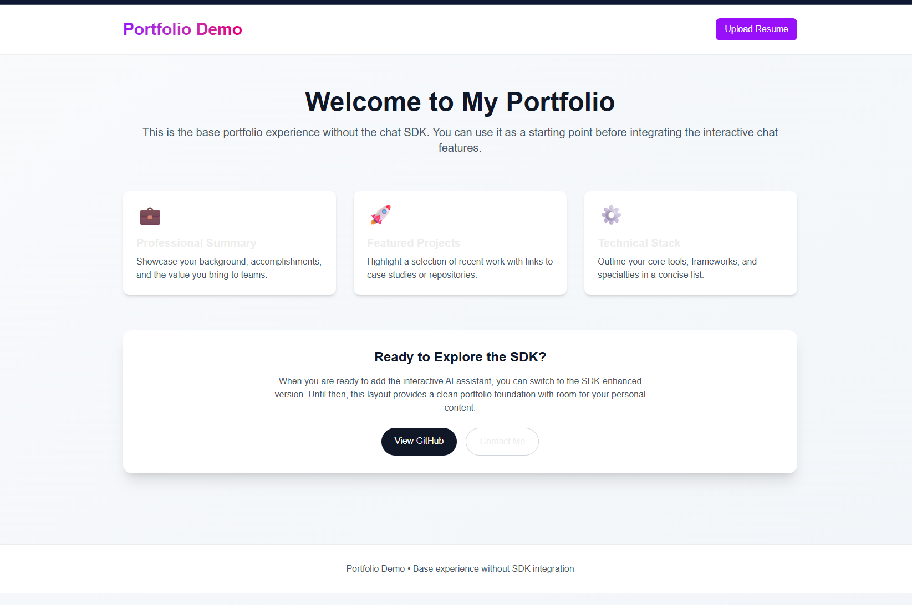
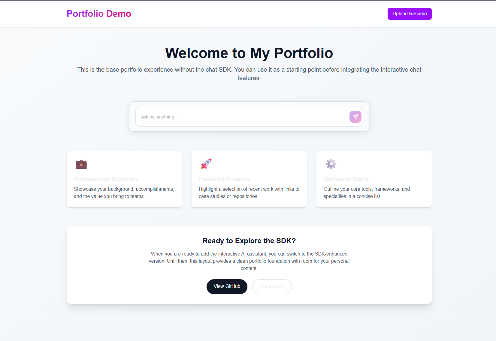
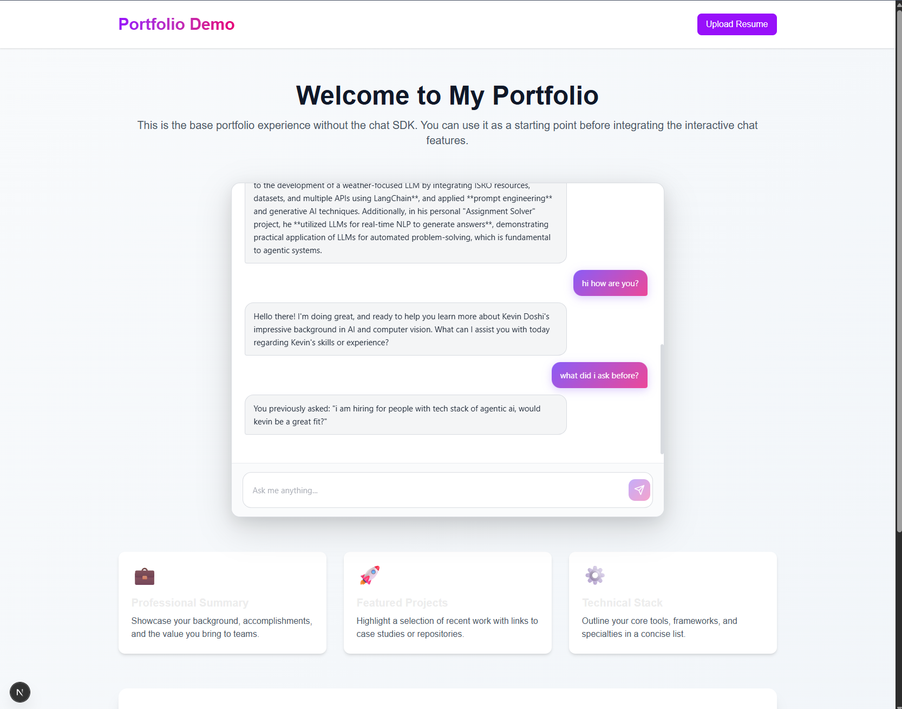

# PortfolioSDK

**Add AI-powered chat to your portfolio in 1 line of code.**

## 🎯 Why PortfolioSDK?

Recruiters can ask the AI about:
- ✅ **Your background** - Experience, education, skills
- ✅ **Your projects** - What you built, technologies used
- ✅ **Your tech stack** - Languages, frameworks, tools
- ✅ **Job fit** - Whether you're eligible for their role

**No more scrolling through resumes** - recruiters get instant, accurate answers about you!

> **💡 Note:** While designed for portfolios, you can integrate PortfolioSDK into **any application**! Connect it to your data source (documents, database, API) and let users ask questions about your content. Perfect for documentation sites, knowledge bases, customer support, and more.

---

## 📸 Before & After

### Before (Without PortfolioSDK)


*Static portfolio - recruiters have to read everything manually*

### After (With PortfolioSDK)


*Interactive AI chat - recruiters ask questions and get instant answers*

### Demo: AI with Memory Access


*The AI has access to your resume and can answer questions about your background, projects, and skills*

---

## 🚀 Quick Start

### Step 1: Install

```bash
npm install portfoliosdk
```

### Step 2: Frontend - Add AutoChat Component

In your `page.tsx` (or any React component):

```tsx
import { AutoChat } from 'portfoliosdk'

export default function Home() {
  return (
    <div>
      <h1>My Portfolio</h1>
      
      {/* That's it! One line of code */}
      <AutoChat />
    </div>
  )
}
```

**Done!** Your portfolio now has an AI chat widget. 🎉

---

## ⚙️ Backend Setup

### Create API Route

Create `app/api/chat/route.ts` (Next.js) or your API endpoint:

```typescript
import { createBackendHandler } from 'portfoliosdk/server'

export const { POST, GET } = createBackendHandler({
  // LLM Provider (choose one)
  llmProvider: 'anthropic',  // or 'openai', 'google', 'groq', 'openrouter'
  llmApiKey: process.env.ANTHROPIC_API_KEY!,
  llmModel: 'claude-sonnet-4-20250514',  // Model name
  
  // Supermemory (Document Search)
  supermemoryApiKey: process.env.SUPERMEMORY_API_KEY!,
  supermemoryContainer: 'portfolio',  // Your container name
  
  // Optional: Customize AI behavior
  systemPrompt: `You are a helpful AI assistant for a portfolio website.
Answer questions about the person's background, projects, and skills.
Be professional and accurate.`,
  
  temperature: 0.7,
  streaming: true  // Enable real-time streaming responses
})
```

### Environment Variables

Create `.env.local`:

```bash
# Required
SUPERMEMORY_API_KEY=sm_your_key_here
SUPERMEMORY_CONTAINER=portfolio

# Choose your LLM provider
ANTHROPIC_API_KEY=sk-ant-your_key_here
# OR
OPENAI_API_KEY=sk-your_key_here
# OR
GOOGLE_API_KEY=your_google_key_here
# OR
OPENROUTER_API_KEY=sk-or-your_key_here
```

### Upload Your Resume/Documents

The AI needs your resume to answer questions! **Upload it via Supermemory Console** (recommended for first-time users):

1. Go to [Supermemory Console](https://console.supermemory.ai)
2. Sign in with your API key
3. Create a container (e.g., `portfolio`)
4. Upload your resume PDF or text file
5. That's it! The AI can now answer questions about your resume

**Alternative: Programmatic Upload**

If you prefer to upload via code:

```typescript
// app/api/upload/route.ts
import { uploadToSupermemory } from 'portfoliosdk/server'

export async function POST(req: Request) {
  const formData = await req.formData()
  const file = formData.get('file') as File
  
  const result = await uploadToSupermemory(
    process.env.SUPERMEMORY_API_KEY!,
    {
      file,
      title: 'My Resume',
      container: 'portfolio'
    }
  )
  
  return Response.json(result)
}
```

---

## 🎨 Don't Like the UI? No Worries!

### Customize with Props

The `AutoChat` component has **40+ customization props**:

```tsx
<AutoChat
  // === Layout & Sizing ===
  inputHeight="60px"
  maxChatHeight="500px"
  maxWidth="800px"
  
  // === Outer Container ===
  chatContainerBackground="white"
  chatContainerShadow="0 4px 24px rgba(0,0,0,0.08)"
  borderRadius="16px"
  
  // === Input Field ===
  inputFieldBackground="rgba(255, 255, 255, 0.95)"
  inputFieldBorderColor="rgba(209, 213, 219, 0.8)"
  inputFieldFocusBorderColor="rgba(147, 51, 234, 0.6)"
  inputTextColor="#1f2937"
  inputPlaceholderColor="rgba(107, 114, 128, 0.6)"
  
  // === Input Area (Bottom Section) ===
  inputAreaBackground="rgba(249, 250, 251, 0.8)"
  
  // === Typography ===
  fontSize="16px"
  fontFamily="Inter, sans-serif"
  
  // === Message Bubbles ===
  userMessageBackground="linear-gradient(135deg, #8b5cf6 0%, #ec4899 100%)"
  userMessageTextColor="#ffffff"
  assistantMessageBackground="rgba(243, 244, 246, 0.95)"
  assistantMessageTextColor="#1f2937"
  messagePadding="12px 16px"
  messageGap="12px"
  
  // === Submit Button ===
  submitButtonSize="44px"
  submitButtonBackground="linear-gradient(135deg, #8b5cf6 0%, #ec4899 100%)"
  submitButtonIconColor="#ffffff"
  
  // === Scrollbar ===
  scrollbarWidth="6px"
  scrollbarThumbColor="rgba(156, 163, 175, 0.4)"
  
  // === Behavior ===
  placeholder="Ask me anything..."
  collapseOnOutsideClick={false}
  expandAnimationDuration="0.4s"
/>
```

### Pre-built Themes

**Dark Mode:**
```tsx
<AutoChat
  chatContainerBackground="rgba(17, 24, 39, 0.95)"
  inputFieldBackground="rgba(31, 41, 55, 0.8)"
  inputTextColor="#f9fafb"
  userMessageBackground="linear-gradient(135deg, #8b5cf6 0%, #ec4899 100%)"
  assistantMessageBackground="rgba(31, 41, 55, 0.8)"
/>
```

**Minimal:**
```tsx
<AutoChat
  borderRadius="20px"
  inputFieldBackground="white"
  inputFieldBorderColor="#e5e7eb"
  userMessageBackground="#3b82f6"
  assistantMessageBackground="#f3f4f6"
/>
```

---

## 🎨 Want to Override CSS? Use These Functions!

### Method 1: Using `className` Prop

```tsx
<AutoChat
  className="my-custom-chat"
  // ... other props
/>
```

Then in your CSS:

```css
/* Move button outside input field */
.my-custom-chat .autochat-input-form {
  display: flex;
  flex-direction: column;
  gap: 12px;
}

.my-custom-chat .autochat-submit {
  align-self: flex-end;
  margin-top: 8px;
}
```

### Method 2: Global CSS Override

```css
/* In globals.css or component CSS */
.autochat-input-form {
  display: flex !important;
  flex-direction: column !important;
}

.autochat-submit {
  position: absolute;
  right: 20px;
  top: 50%;
  transform: translateY(-50%);
}
```

### Available CSS Classes to Override

| Class | What It Controls |
|-------|------------------|
| `.autochat-root` | Entire widget container |
| `.autochat-container` | Main chat box |
| `.autochat-messages` | Messages area |
| `.autochat-message` | Individual message |
| `.autochat-bubble` | Message bubble |
| `.autochat-input-wrapper` | Input area wrapper |
| `.autochat-input-form` | Form (input + button container) |
| `.autochat-input` | Text input field |
| `.autochat-submit` | Submit button |

### Example: Button Outside Input

```css
.my-chat .autochat-input-wrapper {
  display: flex;
  flex-direction: row;
  align-items: center;
  gap: 12px;
}

.my-chat .autochat-input-form {
  flex: 1;
}

.my-chat .autochat-submit {
  flex-shrink: 0;
  /* Button is now outside the form */
}
```

---

## 🔧 Supported LLM Providers

| Provider | Models | Setup |
|----------|--------|-------|
| **Anthropic** | Claude 3.5 Sonnet, Claude 3 Opus | `llmProvider: 'anthropic'` |
| **OpenAI** | GPT-4o, GPT-4 Turbo | `llmProvider: 'openai'` |
| **Google** | Gemini 1.5 Flash, Gemini Pro | `llmProvider: 'google'` |
| **Groq** | Llama 3.3 70B, Mixtral | `llmProvider: 'groq'` |
| **OpenRouter** | 100+ models | `llmProvider: 'openrouter'` |

### Switching Providers

```typescript
// Use Google Gemini
export const { POST, GET } = createBackendHandler({
  llmProvider: 'google',
  llmApiKey: process.env.GOOGLE_API_KEY!,
  llmModel: 'gemini-1.5-flash',
  // ... rest
})

// Use OpenAI
export const { POST, GET } = createBackendHandler({
  llmProvider: 'openai',
  llmApiKey: process.env.OPENAI_API_KEY!,
  llmModel: 'gpt-4o',
  // ... rest
})
```

---

## 📚 Features

- ✅ **One-line integration** - Just import `<AutoChat />`
- ✅ **40+ customization props** - Full control over appearance
- ✅ **CSS override support** - Complete styling flexibility
- ✅ **Multi-provider support** - Anthropic, OpenAI, Google, Groq, OpenRouter
- ✅ **Streaming responses** - Real-time typing effect
- ✅ **Mobile responsive** - Works on all devices
- ✅ **Session management** - Remembers conversation
- ✅ **Document search** - Powered by Supermemory
- ✅ **Zero conversation saving** - Only fetches, never saves (privacy-first)

---

## 🎯 Use Cases

### For Job Seekers
- Recruiters can quickly assess your fit
- Answer questions about your experience
- Showcase your projects interactively

### For Developers
- Add AI chat to any portfolio
- Customize to match your brand
- Full control over UI/UX

### For Recruiters
- Ask specific questions about candidates
- Get instant answers about skills
- No need to read entire resumes

---

## 📖 Complete Props Reference

### Layout & Sizing
- `inputHeight` - Input field height
- `maxChatHeight` - Max height when expanded
- `maxWidth` - Widget width

### Colors & Styling
- `chatContainerBackground` - Main container background
- `inputFieldBackground` - Input background
- `inputFieldBorderColor` - Input border
- `inputFieldFocusBorderColor` - Focus border
- `userMessageBackground` - Your messages background
- `assistantMessageBackground` - AI messages background
- `submitButtonBackground` - Button background

### Typography
- `fontSize` - Text size
- `fontFamily` - Font family

### Behavior
- `placeholder` - Input placeholder text
- `collapseOnOutsideClick` - Auto-collapse on outside click
- `expandAnimationDuration` - Animation speed

**See full list in [Props Documentation](#-dont-like-the-ui-no-worries-i-got-your-back)**

---

## 🐛 Troubleshooting

### Chat not responding?
1. Check your API keys in `.env.local`
2. Make sure you uploaded documents to Supermemory
3. Check browser console for errors

### UI not showing?
1. Make sure you imported `AutoChat` correctly
2. Check if your backend route is working
3. Verify `apiPath` prop matches your route

### Styling not applying?
1. Use `!important` for CSS overrides
2. Check CSS specificity
3. Use `className` prop for scoped styles

---

## 📝 License

MIT

---

## 🤝 Contributing

Contributions welcome! Please open an issue or PR.

---

## 💬 Support

Having issues? Open a GitHub issue or check the documentation.

---

**Made with ❤️ for developers who want to stand out**
